# Academic Work Template Documentation

This repository serves as a template for academic projects that combine LaTeX documentation, Jupyter notebooks for data analysis and visualization, and Python source code for computational implementations.

## Overview

This template provides a structured approach to organizing academic work, ensuring reproducibility, clear documentation, and proper separation of concerns between different types of content.

## Project Structure

### High-Level Organization

### Detailed Folder Structure

```mermaid
graph LR
    subgraph "Repository Root"
        A[📁 latex-template/]
    end
    
    subgraph "Documentation"
        B[📁 docs/]
        B --> B1[📁 report/]
        B1 --> B2[📄 report_main.tex]
        B1 --> B3[📄 references.bib]
        B1 --> B4[📄 plain.bst]
        B1 --> B5[📄 Makefile]
        B1 --> B6[📁 build/]
        B6 --> B7[Generated Files]
    end
    
    subgraph "Analysis & Visualization"
        C[📁 notebooks/]
        C --> C1[📓 *.ipynb files]
        C --> C2[Data Analysis]
        C --> C3[Visualizations]
    end
    
    subgraph "Source Code"
        D[📁 src/]
        D --> D1[📁 classes/]
        D --> D2[📁 plots/]
        D1 --> D3[🐍 Python Classes]
        D2 --> D4[📊 Plotting Code]
    end
    
    subgraph "Utilities"
        E[📁 scripts/]
        E --> E1[⚙️ Utility Scripts]
    end
    
    subgraph "Configuration"
        F[📄 Makefile]
        G[📄 requirements.txt]
        H[📄 README.md]
        I[📄 setup-hooks.sh]
    end
    
    A --> B
    A --> C
    A --> D
    A --> E
    A --> F
    A --> G
    A --> H
    A --> I
    
    style A fill:#e3f2fd
    style B fill:#f3e5f5
    style C fill:#e8f5e8
    style D fill:#fff3e0
    style E fill:#fce4ec
```

## Folder Descriptions

### 📁 `docs/` - LaTeX Documents

The `docs` folder contains all LaTeX-related files for generating academic reports, papers, and presentations.

```mermaid
graph TD
    A[docs/] --> B[report/]
    B --> C[📄 report_main.tex]
    B --> D[📄 references.bib]
    B --> E[📄 plain.bst]
    B --> F[📄 Makefile]
    B --> G[📁 build/]
    
    C --> C1[Main LaTeX Document]
    D --> D1[Bibliography Database]
    E --> E1[Bibliography Style]
    F --> F1[Build Automation]
    G --> G1[Compiled Output]
    
    style A fill:#f3e5f5
    style B fill:#f8bbd9
    style C fill:#e1bee7
    style D fill:#e1bee7
    style E fill:#e1bee7
    style F fill:#e1bee7
    style G fill:#e1bee7
```

**Contents:**
- `report_main.tex`: Main LaTeX document file
- `references.bib`: Bibliography database in BibTeX format
- `plain.bst`: Bibliography style file
- `Makefile`: Build automation for LaTeX compilation
- `build/`: Directory containing generated files (PDFs, auxiliary files)

**Purpose:**
- Academic report writing
- Paper drafts and manuscripts
- Thesis chapters
- Presentation slides (if using Beamer)

### 📁 `notebooks/` - Jupyter Notebooks

The `notebooks` folder is designed for interactive data analysis, exploration, and visualization.

```mermaid
graph TD
    A[notebooks/] --> B[Data Analysis]
    A --> C[Exploratory Analysis]
    A --> D[Visualizations]
    A --> E[Prototyping]
    A --> F[Results Documentation]
    
    B --> B1[📓 data_analysis.ipynb]
    C --> C1[📓 exploration.ipynb]
    D --> D1[📓 visualization.ipynb]
    E --> E1[📓 prototype.ipynb]
    F --> F1[📓 results.ipynb]
    
    style A fill:#e8f5e8
    style B fill:#c8e6c9
    style C fill:#c8e6c9
    style D fill:#c8e6c9
    style E fill:#c8e6c9
    style F fill:#c8e6c9
```

**Typical Contents:**
- Data loading and preprocessing notebooks
- Exploratory data analysis (EDA)
- Algorithm implementation and testing
- Results visualization and plotting
- Statistical analysis and hypothesis testing

**Purpose:**
- Interactive development and testing
- Data exploration and visualization
- Rapid prototyping of algorithms
- Documentation of analysis workflow
- Generation of figures for reports

### 📁 `src/` - Source Code

The `src` folder contains the main Python source code organized into logical modules.

**Structure:**
- `classes/`: Core Python classes and algorithms
  - Algorithm implementations (A*, BFS, DFS, Dijkstra)
  - Problem definition classes
  - Graph plotting utilities
  - Abstract data types
- `plots/`: Plotting and visualization code
  - Jupyter notebooks for plot generation
  - Generated images and figures

**Purpose:**
- Reusable algorithm implementations
- Core computational logic
- Data structures and classes
- Plotting and visualization utilities
- Modular code organization

### 📁 `scripts/` - Utility Scripts

The `scripts` folder contains utility scripts for project automation and maintenance.

**Purpose:**
- Git hooks for quality control
- Build and deployment automation
- Testing and validation scripts
- Project maintenance utilities

## Workflow Integration

## Best Practices

### 1. Development Workflow
1. **Exploration**: Start with notebooks for data exploration and algorithm prototyping
2. **Implementation**: Move stable code to `src/` as reusable modules
3. **Documentation**: Document findings and methodology in LaTeX reports
4. **Integration**: Use Makefile for automated builds and testing

### 2. Code Organization
- Keep notebooks focused on specific analysis tasks
- Extract reusable functions and classes to `src/`
- Maintain clear separation between exploration and production code
- Use proper Python package structure with `__init__.py` files

### 3. Documentation Standards
- Write comprehensive LaTeX documentation in `docs/`
- Include proper citations using BibTeX
- Generate figures in notebooks and reference them in reports
- Maintain version control for all components

### 4. Environment Management
- Use `requirements.txt` for Python dependencies
- Include LaTeX compilation instructions in Makefiles
- Set up Git hooks for code quality checks
- Use virtual environments for Python development

## Getting Started

1. **Clone the template**: Start with this repository structure
2. **Set up environment**: Install Python dependencies and LaTeX distribution
3. **Configure tools**: Set up Git hooks and development environment
4. **Start development**: Begin with notebooks for exploration
5. **Build documentation**: Use Makefiles for automated compilation

This template ensures a professional, organized approach to academic work that promotes reproducibility and clear documentation standards.